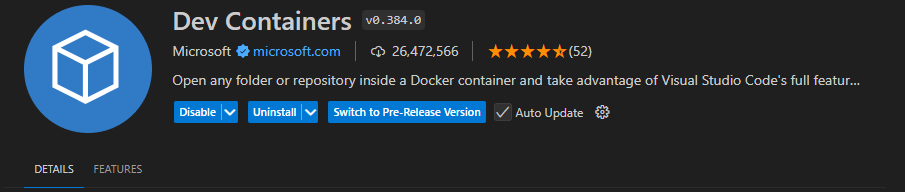

# ORB-SLAM3 Docker Setup (CUDA + X11(GUI) Support + Ubuntu 22.04)

This guide will walk you through setting up ORB-SLAM3 in a Docker container, running it with a EuRoC dataset, and testing it with different configurations like Monocular, Monocular-Inertial, and Stereo.

After setting up the Docker container, you can run the ORB-SLAM3 examples with GPU acceleration and X11 forwarding for graphical output that will look like this:


You will also have ability to attach to a running container and compile code using ORB SLAM 3 library. This setup is more for development purposes and testing different configurations of ORB-SLAM3.

## Prerequisites

- Docker installed
- NVIDIA GPU and drivers with CUDA support for GPU acceleration
- X11 server running for displaying graphical applications (e.g., `VcXsrv` for Windows). Material for setting up X11 server on Windows is also included below.

## Getting Started

### Step 1: Running the Docker Container

First you need to build the Docker image. You can do this by running the following command in the root directory of this repository:

```bash
docker build -t orb_slam3:latest .
```

To run the ORB-SLAM3 Docker container with GPU support and X11 forwarding for graphical output:

```bash
docker run -it --gpus all --env="DISPLAY" \
  --env="QT_X11_NO_MITSHM=1" \
  --volume="/tmp/.X11-unix:/tmp/.X11-unix:rw" \
  --name orb_slam3_container \
  orb_slam3:latest
```

### Step 2: Dataset Setup

Navigate to the ORB-SLAM3 directory and download the EuRoC MAV dataset. This dataset is used for testing ORB-SLAM3 with different configurations.

```bash
cd /opt/ORB_SLAM3

# Create directory for dataset
mkdir -p Datasets/EuRoc
cd Datasets/EuRoc/

# Download the dataset
wget -c http://robotics.ethz.ch/~asl-datasets/ijrr_euroc_mav_dataset/machine_hall/MH_01_easy/MH_01_easy.zip

# Create a directory for MH_01_easy dataset and extract it
mkdir MH01
unzip MH_01_easy.zip -d MH01/
```

### Step 3: Installing Additional Packages

To run graphical applications inside the container (e.g., `xclock` for testing display):

```bash
apt-get update && apt-get install -y x11-apps
```

Test the X11 setup by running:

```bash
xclock
```

You should see the clock displayed on your X11 server.

### Step 4: Running ORB-SLAM3 Examples

To run different ORB-SLAM3 configurations, use the following commands inside ORB-SLAM3 directory (which is located inside `/opt` inside the container):

#### Stereo Example

```bash
./Examples/Stereo/stereo_euroc ./Vocabulary/ORBvoc.txt \
  ./Examples/Stereo/EuRoC.yaml \
  ../Datasets/EuRoc/MH01 \
  ./Examples/Stereo/EuRoC_TimeStamps/MH01.txt dataset-MH01_stereo
```

### Step 5: Setting Up X11 Server on Windows

If you're running this on Windows, you can set up an X11 server using `VcXsrv`. Download and install it from the following link:

- [VcXsrv SourceForge](https://sourceforge.net/projects/vcxsrv/)

Ensure that `DISPLAY` is correctly set in your Docker run command to match your X11 server configuration. It is also recommended to disable access control on the X11 server to avoid permission issues:

If using win app you just need to check the box "Disable access control" in the VcXsrv configuration.

**Alternatively:**
If using linux based environment, you can use the following commands to grant access to the X11 server:

```bash
export DISPLAY=host.docker.internal:0
xhost +
```

If you want to test the X11 setup, you can run the following command inside the container:

```bash
xclock
```

This should display a clock on your X11 server. If you see the clock, the X11 setup is working correctly. If not, check your X11 server configuration and Docker run command.

## Attaching to a Running Container

If you want to attach to a running container, you can use the following command:

```bash
docker exec -it orb_slam3_container bash
```

This will open a new shell inside the running container.

**Alternatively:**
You could use vscode to attach to the container, you just need to install the extension "Dev - Containers" and open the project folder in the container.



If you want to attach to a running container, you can use the following command:

```bash
ctrl + shift + p
Remote-Containers: Attach to Running Container
```

Select `/opt/` as the workspace folder. Later if you want to change the workspace folder you need to change configuration with the following steps:

```bash
ctrl + shift + p
Remote-Containers: Open Container Configuration File
```
